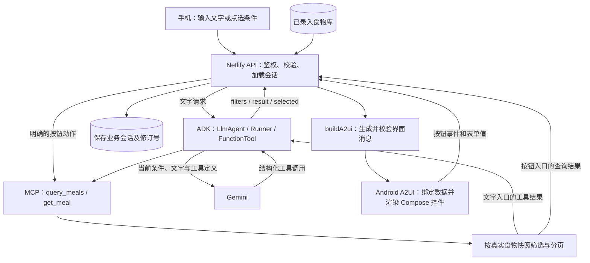

本文依据逐步选餐版本的 AI-Meal 源代码梳理。用户已确认按实际实现说明职责、数据流、界面体现与能力边界。

**ADK 负责选餐请求中的模型和工具执行；A2UI 负责把选餐状态转换为可交互的手机界面。** 两者之间由业务 API、结构化查询结果和会话状态衔接。

| 部分 | 当前职责 | 主要实现 |
| --- | --- | --- |
| ADK | 创建 LlmAgent、Runner 和临时 session；调用 Gemini；执行 FunctionTool；收集执行证据 | src/meal-picker/agent.ts |
| Gemini | 文字入口解析用户明确表达的条件，产生工具调用；明确的点选入口直接执行 MCP 工具，跳过模型 | src/meal-picker/agent.ts |
| MCP | 发现并执行 query_meals、get_meal，返回已录入食物的实际查询结果 | src/meal-picker/mcp.ts |
| 业务筛选 | 按餐别、预算、辣度、主食、清淡筛选，三条分页，计算最低预算调整 | src/meal-picker/menu.ts |
| A2UI | 描述组件树、表单数据绑定和按钮事件；Android 解析并渲染 | src/meal-picker/a2ui.ts、Android MealViewModel.kt |
| Android Compose | 原生页面、A2UI 组件的实际外观及交互控件 | MainActivity.kt、MealCatalog.kt、FoodScreen.kt |
| Netlify Blobs | 保存食物与业务会话，提供跨请求的数据与 ETag 并发保护 | foods.ts、store.ts |

**文字选餐。** 用户输入“午饭，30 元以内，不要辣”，手机发送 text 和当前条件。ADK 将该请求交给 Gemini，模型通过 query_meals 的 patch 参数表达 meal=lunch、budget=30、spice=none。未提及的字段保留当前值；业务 schema 再次校验。FunctionTool 经 MCP 查询已保存食物，候选与价格由实际数据决定。后端保存结果并用固定模板生成 A2UI，手机显示选项卡片。

**点选选餐。** ChoicePicker 值绑定到 /form/meal、/form/budget 等路径，点选首先更新手机上的 A2UI 数据模型。点击“更新推荐”才把绑定的 form 放入 update 事件。已有会话发送 sessionId、revision 与 action；初次更新转换为创建 session。服务端转换表单条件，并直接执行 MCP 查询工具，不调用模型。换一批保留条件、改变分页；确认选择使用用户点击的实际候选 ID。

**A2UI 消息。** 每次响应包含 session 元数据与三条有序 messages：createSurface 创建选餐区域，updateDataModel 写入 /form，updateComponents 描述 ChoicePicker、TextField、Card、Text、Button、Row、Column。消息使用 v0.9.1 并经官方 schema 校验。Android 解析这些消息后，用官方 AndroidX 渲染器与自定义 Material catalog 展示。当前采用完整界面响应，删除旧 surface 后重新处理消息；没有实现增量 JSONL 流式更新。

**界面体现。** A2UI 按业务步骤只展示当前所需界面：缺餐别的午饭/晚饭按钮、无匹配原因与真实调整方案、候选卡片、最终确认。完整条件表单只在“改一下条件”时显示。白底、灰卡片、绿色按钮、字号与圆角来自 Android 主题和 catalog 实现。首页标题、文字输入框、连接配置、空菜单引导和食物录入管理页使用原生 Compose。

**食物录入。** FoodScreen 表单 → POST /api/meal-picker/foods → 严格字段校验 → ai-meal-foods Blobs → 刷新列表。此流程直接使用业务接口，不调用 ADK 模型，也不使用 A2UI 表单。后续选餐才读取这些已录入食物。

**当前边界。** UI 结构由 buildA2ui 的固定代码模板决定，Agent 输出结构化条件和工具结果；尚未实现模型自主生成页面布局。候选采用确定性条件筛选与三条分页，尚无模型对食物的个性化评分排序。MCP client/server 使用同一 Function 进程内的 InMemoryTransport，实际执行协议发现与调用，尚非独立远程菜单服务。ADK 内存 session 每次请求创建并清理，长期状态来自 Blobs 中的业务会话。没有食物时跳过模型，显示录入引导。新增 flow.ts 推导 start、need_meal、no_match、candidates、editing、selected 步骤；session.execution 标明上次操作是 adk 或 direct，便于核验。

文字入口使用 ADK 模型解析并执行 MCP，明确的补餐别、调整、查询、换一批、确认、重新开始动作直接执行 MCP。业务代码依据真实查询结果判断下一步；A2UI 将该步骤转换为可操作界面。单项放宽仅在当前菜单确有匹配时显示，点击后保留其他条件。

**代码核对入口。**

- ADK Agent、工具与模型请求：`src/meal-picker/agent.ts`
- MCP 发现与实际调用：`src/meal-picker/mcp.ts`
- 筛选、分页与预算调整：`src/meal-picker/menu.ts`
- A2UI 消息与按钮事件：`src/meal-picker/a2ui.ts`
- 路由、输入校验与结果持久化：`src/meal-picker/api.ts`
- Android 解析、绑定、事件回传：`android/app/src/main/java/dev/a2ui/mealpicker/MealViewModel.kt`
- A2UI 原生组件外观：`android/app/src/main/java/dev/a2ui/mealpicker/MealCatalog.kt`
- 原生录入表单：`android/app/src/main/java/dev/a2ui/mealpicker/FoodScreen.kt`

实际模型链路验收结果见 `verification/meal-foods-20261009/final-cloud-selection.local.json`。它记录真实模型查询与确认候选通过，独立临时验收会话已删除。
